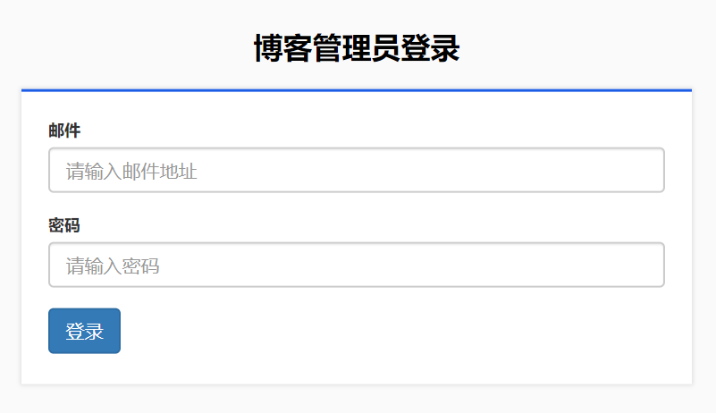
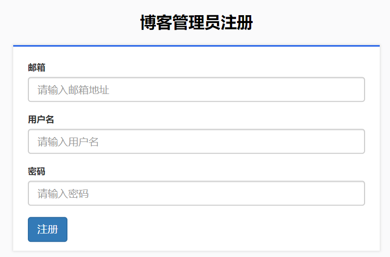
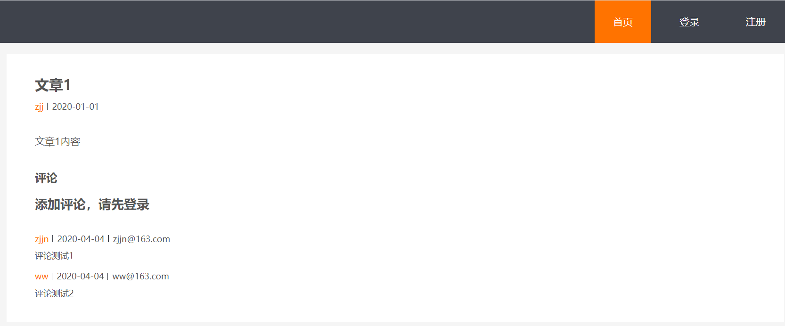
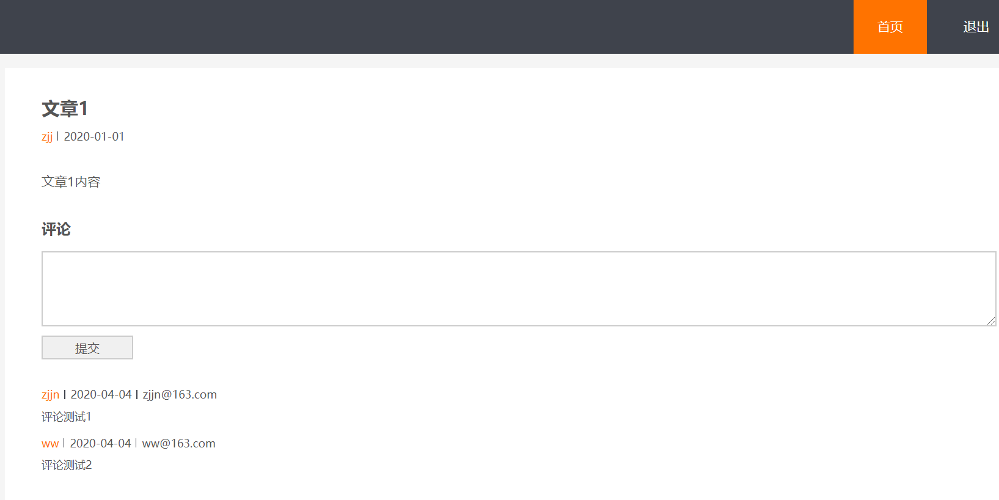
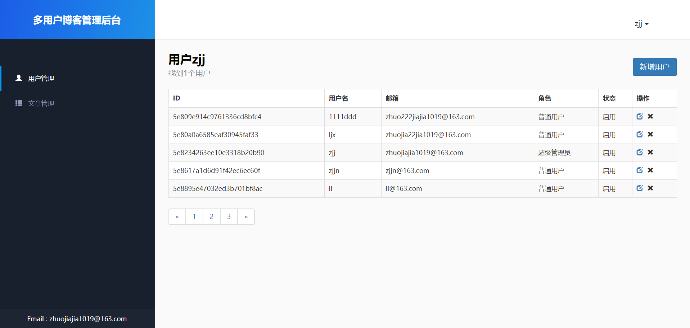
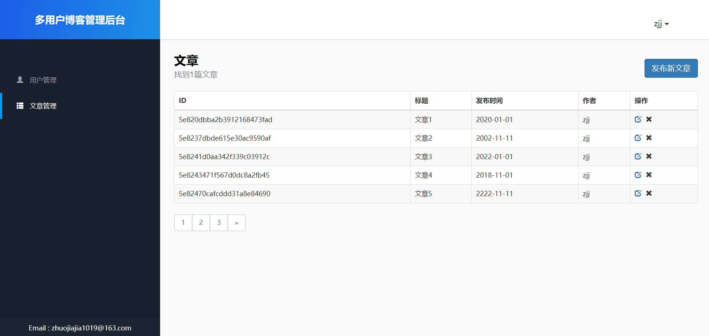
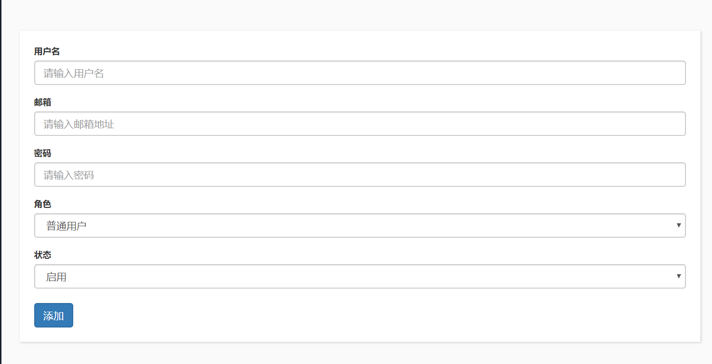

# Node+Express+Mongodb+Art-template后台管理、前台展示多用户博客系统
## 描述
基于node.js的博客，没有采用前后端分离，采用后端渲染的方式


项目网址 http://49.232.150.231:3308/home/  可以体验，前台注册默认是普通账号只能访问前台展示页面，无法访问后台页面。如需增删改查文章在此提供一个超级管理员账号：zhuojiajia1019@163.com 密码：123 ，或者联系我我把你注册的账号添加为超级管理员，登录后台之后除了删除超级管理员账号之外可以随意折腾，要是删了超级管理员我还得在代码里再生成一个，谢谢理解~（对了，由于户口迁移域名需要重新备案，所以暂时还不能通过域名访问）

主要目的：

- 了解node.js
- 熟悉Express框架
- 熟悉后端开发的流程

## 主要技术

- 服务端：Node.js `v10.19.0 `
- 数据库：MongoDB `v3.4.10`
- 数据库操作工具：mongoose`^5.9.6`
- Express框架：`~4.16.1`
- 模板引擎-art-template: `^4.13.2`

## 页面目前功能

前台：

- 首页展示
- 登陆
- 注册
- 退出
- 文章详情
- 评论
- 分页


后台：

- 用户管理 (普通/超级管理员)
- 用户增删改查
- 文章管理
- 文章增删改查


## 使用方法
首先设置一下数据库，三个collection我已经放在blog-datebase文件夹中了
数据库密码我是放在系统环境变量中的
当然你可以选择无密码连接

```
# install dependencies
(c)npm install 或者 yarn
# serve at localhost: 80 (可自行更改)
nodemon

```

## 页面效果
效果展示图片加载可能比较慢，请耐心等待，感谢。

### 首页：


### 登录：


### 注册：


### 文章详情：


### 登录后评论：


### 后台用户列表：


### 后台文章列表：


### 新增用户：



